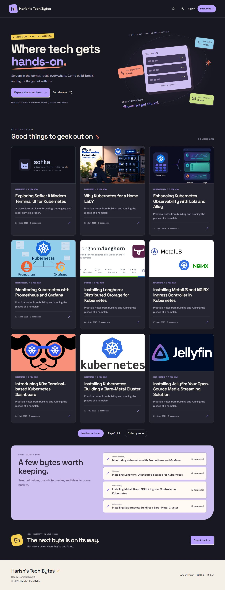

# Tech Bytes Playground

A custom Ghost theme for hands-on technology writing, created for [Harish's Tech Bytes](https://harish2k01.in). Colorful illustrations and a decorative idea lab introduce the articles; readable typography and a focus mode support longer tutorials.



## Features

- Light, dark, and system appearance, with a remembered reader preference.
- Native Ghost search, Portal membership, subscription, account access, and comments.
- Topic archives through article metadata, plus randomized article discovery.
- Original article feature images, with a colorful generic fallback for posts without an image.
- Featured-post selections using Ghost's built-in Featured setting.
- Automatic article contents, reading progress, copyable code blocks, and sharing.
- Tag and author archives, Load More with pagination links as a fallback, related posts, and existing post URLs.
- Ghost editor content, including wide/full-width cards, image zoom and galleries, embeds, and member-gated content.
- Local fonts and icons, keyboard navigation, mobile layouts, and reduced-motion support.

## Build and install

Download the versioned theme ZIP from [GitHub Releases](https://github.com/harish2k01/tech-bytes-playground/releases). `SHA256SUMS.txt` accompanies each release. The automatically generated source-code archives are not the installable theme.

Requires Node.js 22.17+ or 24 and Ghost 5.54.1 or later.

```sh
npm ci
npm test
npm run zip
```

Upload `dist/tech-bytes-playground-0.1.0.zip` through Ghost Admin's theme settings. Preview the theme before activating it. The theme does not change posts, routes, membership settings, or existing comments. A previous theme can be activated again in Ghost Admin.

`npm run dev` rebuilds assets on changes. `npm run preview` serves a local fixture preview of the actual templates; it does not connect to Ghost accounts or send subscriptions or comments.

## Configuration

Ghost Admin accent color and heading/body fonts are honored alongside the colorful theme artwork. Ghost Admin exposes navigation location, hero text, default appearance, featured-section text, newsletter heading, and footer copy. Logo, secondary navigation, public tags, membership, and comments use the publication's existing Ghost settings. The header contains the brand, search, appearance, and member actions. Primary navigation uses Ghost Admin links and appears in the footer by default; the Navigation location setting moves it to the header if desired. The homepage topic strip stays omitted.

The featured section lists up to four published posts marked **Featured** in Ghost, newest first, and disappears when no posts are featured. It does not impose a reading sequence or require an internal tag. The hero artwork is decorative and describes building, learning, and sharing rather than linking to categories that may change. Tag archives display the tag name, optional cover image, and description configured in Ghost. Leave the description blank in Ghost Admin to omit it. Surprise Me chooses from the latest 100 published posts.

The existing `custom-full-feature-image`, `custom-narrow-feature-image`, and `custom-no-feature-image` template names remain available for articles already using them.

## Automatic releases

Release publication uses GitHub Actions’ built-in `GITHUB_TOKEN` with **Contents: write** and **Pull requests: read**. Releases and annotated tags use the `github-actions[bot]` identity; no custom App ID, private key, or personal token is required. npm is used to build and validate the theme ZIP, not to publish an npm package. GitHub may restrict the built-in token when tagging historical revisions that differ from the default branch’s workflow files; the workflow stops on permission errors and preserves reserved versions for recovery rather than changing the target commit. See [GitHub token permissions](https://docs.github.com/en/actions/reference/workflows-and-actions/workflow-syntax#permissions).

Every PR targeting the repository's default branch requires exactly one `major`, `minor`, or `patch` label. Other labels are allowed. `path` is a typo and fails the check. A merged PR triggers reconciliation of pending merged PRs, validation, packaging, and publication of one combined GitHub Release with the installable ZIP and SHA-256 checksum. Tags and release titles use only the semantic version, such as `v0.4.1`. Release notes use GitHub’s automatic generation API, matching the Generate release notes button, for changes between the preceding semantic tag and the exact release tag. GitHub supplies the changelog, contributors, and comparison link; the workflow appends installation and checksum instructions. A generation failure stops publication and can be retried with the reserved version. No npm package is published. GitHub Packages is a package registry rather than generic ZIP hosting; Releases provide the directly downloadable Ghost upload.

| Label   | Example from v1.2.3 |
| ------- | ------------------- |
| `major` | v2.0.0              |
| `minor` | v1.3.0              |
| `patch` | v1.2.4              |

Before the first release, `package.json` supplies the baseline, currently 0.1.0: `major` produces 1.0.0, `minor` produces 0.2.0, and `patch` produces 0.1.1. Later releases use the highest stable version tag. Pending PRs share one version bump using the strongest label (`major` before `minor` before `patch`). Each new tag reserves the current default-branch revision before the build; the ZIP's package metadata is set to that release version during the build. Source files on the default branch are not changed by the release job.

| Scenario                                                         | Behavior                                                                                                                             |
| ---------------------------------------------------------------- | ------------------------------------------------------------------------------------------------------------------------------------ |
| Missing or multiple release labels                               | PR check fails; publication stops if the PR is merged anyway.                                                                        |
| Label added, removed, or changed                                 | The label check reruns using current PR labels.                                                                                      |
| PR closed without merging or merged into another branch          | No release.                                                                                                                          |
| Direct push to the default branch                                | Theme validation runs; no new release is created.                                                                                    |
| Closely spaced merges                                            | Serialized runs combine pending PRs into one release. Merges after tag reservation remain pending for the next run.                  |
| Build, validation, or API failure                                | Publication stops; later pending PRs wait for successful recovery.                                                                   |
| Failure after tag creation or draft upload                       | Run **Release theme** manually or rerun the failed workflow. The existing version is reused and incomplete draft assets are rebuilt. |
| Rerun after successful publication                               | No new version or asset overwrite. Later label edits do not change a published release.                                              |
| Tag points to the wrong revision or published assets are missing | Fails for manual investigation; published assets and tags are never overwritten.                                                     |

The manual **Release theme** workflow reconciles pending merged PRs in one batch built from the current default branch. That snapshot also includes any direct pushes already on the branch. Direct pushes alone do not trigger a release. Published per-PR releases from the earlier policy remain recognized. The release label is validated again before reserving a version. Retain the intended label during recovery; once a tag is reserved, changing its release label fails until the original label is restored. The workflow uses the built-in `GITHUB_TOKEN`; no release-app credentials are needed. If the branch advances before reservation, the workflow refreshes its snapshot, up to five attempts. An existing reservation is reused without moving its tag or changing its PR membership; later merges wait for another run. Only trusted default-branch code is used by the privileged release workflow, including for merged fork PRs. Branch protection requires **Release label** and **Theme validation** before merging.

## Validation

`npm test` builds assets, checks template syntax and integration hooks, tests heading-anchor collisions, and runs Ghost's GScan validator. GitHub Actions repeats validation and produces a theme ZIP. A fixture preview is useful for visual review; native Portal, search indexing, comments, and access restrictions must also be checked on a running Ghost installation before production activation.

GScan's archive-extraction dependency currently has upstream npm audit advisories. This project validates its local directory, does not extract externally supplied ZIP files through GScan, and excludes development dependencies from the installable theme. Handlebars is overridden to the patched 4.7.10 release.

## License

MIT. Fonts include their respective upstream license files. Lucide icons are ISC licensed, and PhotoSwipe is MIT licensed. Third-party license notices accompany the packaged assets.

The homepage discovery panel uses public tags with published posts, counts, and optional Ghost tag descriptions. In Design settings, choose Topics, Featured posts, or Hidden and edit the corresponding heading and description. Primary and secondary footer navigation share one wrapping row. Shared destinations appear once when JavaScript is enabled. Labels and destinations come from Ghost navigation settings; rename the About link to About Me there.

The theme includes subtle button feedback and same-origin page fades in browsers supporting cross-document View Transitions. Reduced-motion preferences disable these effects; other browsers use ordinary navigation.

Upload `assets/branding/publication-icon-512.png` as your Ghost publication icon in Settings → Design & branding. The SVG, 16/32px PNGs, multi-size ICO, and Apple touch icon are included in the repository and theme ZIP. A configured Ghost publication icon takes precedence over the theme favicon fallback. Run `npm run branding` to regenerate these assets from the vector source.

### All topics directory

Publish a page in Ghost with the Topics template selected in Page settings. Its title, URL, excerpt and content remain editable in Ghost. The template lists all public tags; the homepage discovery section automatically adds View all topics once this page is published. No routes.yaml change is required. Unpublishing the page removes the link.
